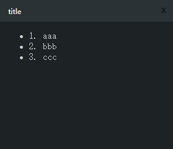
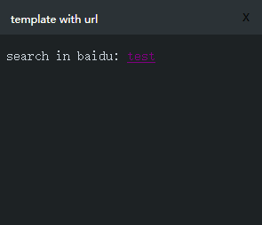

# WindowsNotify

## 介绍

### 依赖

.net core 3.1 Runtime

windows安装方法：

<https://dotnet.microsoft.com/download/dotnet/3.1>

## 使用方法

简单使用：

``` sh
.\WindowsNotify.exe -title "title" -msg "a notify msg"
```

修改弹窗持续时间（默认5秒）

``` sh
.\WindowsNotify.exe -title "title" -msg "a notify msg" -duration 10
```

修改颜色

带上`-light`即可，默认深色调

``` sh
.\WindowsNotify.exe -title "title" -msg "a notify msg" -light
```

## 使用自定义模板

内置的模板只支持消息正文以普通文本的形式呈现，如果需要满足个性化的样式，可以使用自定义模板

使用方法：

### 1. 在WindowsNotify.exe同级新建`template`文件夹

### 2. 新建模板文件，命名格式为`{{template}}.html`，在里面填充html标签的body部分（不包含body标签）

这里以模板名称为`my_template`为例，新建的html文件名称为`my_template.html`

在里面填写如下内容

``` html
<ul>
	<li>1. {first_param}</li>
	<li>2. {second_param}</li>
	<li>3. {third_param}</li>
</ul>
```

WindowsNotify会补全整个html并展示在弹窗中。

``` sh
.\WindowsNotify.exe -title "title" -template my_template -first_param aaa -second_param bbb -third_param ccc
```

在模板中可以使用自定义参数，比如上面的{first_param}/{second_param}/{third_param}是占位符，占位符使用大括号`{}`括起来，并且需要在弹窗参数中指定这些参数的值。

比如示例中这个命令的弹窗效果：



### 3. 使用带有超链接（< a >标签）的模板

这里以模板名称为`my_template_with_url`为例，新建的html文件名称为`my_template_with_url.html`

在里面填写如下内容

``` html
<p>search in baidu: <a href="https://www.baidu.com/s?wd={query}">{query}</a></p>
```

使用：

``` sh
.\WindowsNotify.exe -title "template with url" -template my_template_with_url -query test
```

效果：



点击里面的链接后，会在**系统默认浏览器**中打开百度搜索query中的内容。

## 注意事项

1. 虽然弹窗内容可以自定义，但是由于只是起到提示作用，不建议内容过长，如果需要详细注明，可以使用带有链接的弹窗
2. 程序自带的主窗体其实是一个WPF的WebBrowser控件，内核是IE浏览器，不建议在模板中写复杂的内容，可能会遇到样式问题或者JavaScript的浏览器兼容问题。
3. 弹窗目前只支持固定位置（右下角）弹窗，同时有多个弹窗会存在遮挡的问题。
